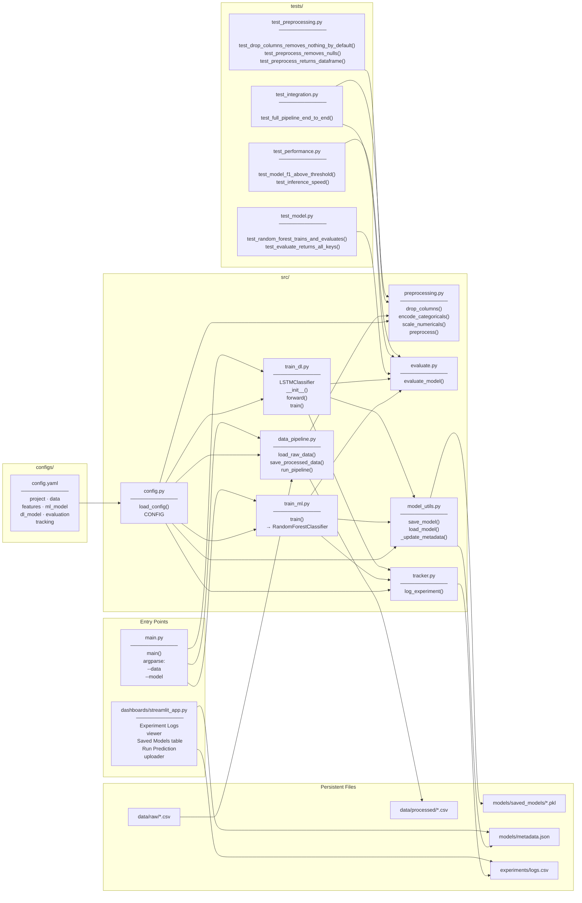
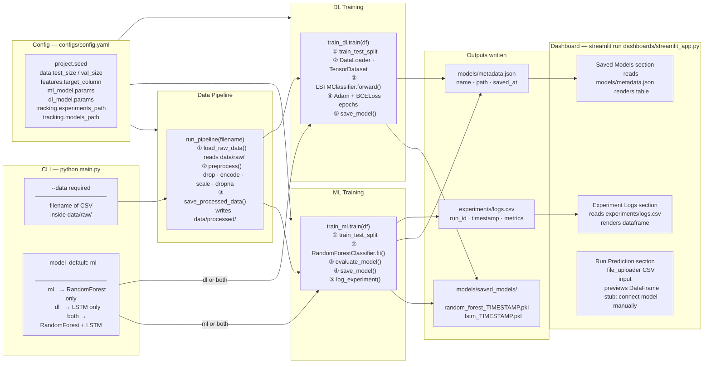
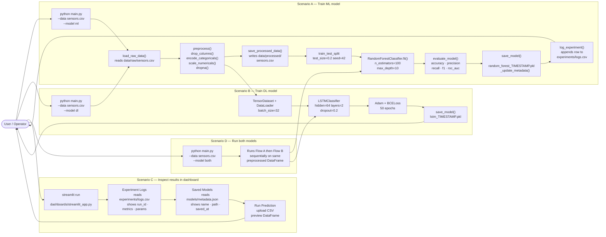

# Architecture Diagrams

## 1. Package Overview — Files, Functions & Connections

All modules, their public functions, and every import dependency across the package.

---

## 2. Entry Points, Arguments & What's Behind Them

Every way to invoke the system, the arguments it accepts, and what executes.

---

## 3. Example User Flow — Common Interactions

End-to-end sequence for three typical scenarios: train ML, train DL, inspect results.

